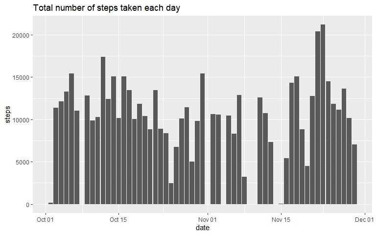

## Loading and preprocessing the data


```r
#loading data
unzip("activity.zip")
activity_data <- read.csv("activity.csv")

str(activity_data)
```

```
## 'data.frame':	17568 obs. of  3 variables:
##  $ steps   : int  NA NA NA NA NA NA NA NA NA NA ...
##  $ date    : chr  "2012-10-01" "2012-10-01" "2012-10-01" "2012-10-01" ...
##  $ interval: int  0 5 10 15 20 25 30 35 40 45 ...
```

```r
#preprocessing (converting date from  chr to Date object)
activity_data$date <- as.Date(activity_data$date)
str(activity_data)
```

```
## 'data.frame':	17568 obs. of  3 variables:
##  $ steps   : int  NA NA NA NA NA NA NA NA NA NA ...
##  $ date    : Date, format: "2012-10-01" "2012-10-01" ...
##  $ interval: int  0 5 10 15 20 25 30 35 40 45 ...
```


## What is mean total number of steps taken per day?


```r
total_steps_per_day <- aggregate(steps ~ date, data = activity_data, sum, na.rm = TRUE)
library(ggplot2)
g <- ggplot(data = total_steps_per_day, aes(date,steps))
g+geom_bar(stat = "identity")+labs(title = "Total number of steps taken each day")
```

<!-- -->

```r
mean(total_steps_per_day$steps)
```

```
## [1] 10766.19
```

```r
median(total_steps_per_day$steps)
```

```
## [1] 10765
```

## What is the average daily activity pattern?


```r
avg_steps_per_interval <- aggregate(steps ~ interval, data = activity_data, mean, na.rm = TRUE)
library(ggplot2)
g <- ggplot(data = avg_steps_per_interval,aes(interval,steps))
g+geom_line()+labs(x = "time (minutes)",y = "average number of steps across all days",title = "Average number of steps in 5-minute intervals for all days")
```

<!-- -->

```r
interval_with_max_avg <- avg_steps_per_interval[avg_steps_per_interval$steps == max(avg_steps_per_interval$steps), "interval"] 
```

The 5-minute interval with maximum number of steps on average across all the days in the dataset is **835**.

## Imputing missing values


```r
miss_values <-  nrow(activity_data[!complete.cases(activity_data),]) 
```

the total number of missing values in the dataset is **2304**.


```r
imputed_data <- activity_data

#replacing NAs with average number of steps across all days for that interval

imputeMean <- function(interval)
{
  round(avg_steps_per_interval[avg_steps_per_interval$interval == interval,"steps"])
}

for(i in 1:nrow(imputed_data))
{
  if(is.na(imputed_data[i,"steps"]))
  {
    imputed_data[i,"steps"] <- imputeMean(imputed_data[i,"interval"])
  }
}

new_total_steps_per_day <- aggregate(steps ~ date, data = imputed_data, sum, na.rm = TRUE)
library(ggplot2)
g <- ggplot(data = new_total_steps_per_day, aes(date,steps))
g+geom_bar(stat = "identity")+labs(title = "Total number of steps taken each day")
```

<!-- -->

```r
mean(new_total_steps_per_day$steps)
```

```
## [1] 10765.64
```

```r
median(new_total_steps_per_day$steps)
```

```
## [1] 10762
```


## Are there differences in activity patterns between weekdays and weekends?


```r
imputed_data$day <- weekdays(imputed_data$date) 
imputed_data$day <- factor(imputed_data$day, levels = c("Monday","Tuesday","Wednesday","Thursday","Friday","Saturday","Sunday"))
imputed_data$daytype <- sapply(imputed_data$day,function(x) ifelse(as.integer(x)>4,"weekend","weekday"))
avg_steps_by_interval_and_daytype <- aggregate(steps ~ interval + daytype, data = imputed_data, mean, na.rm = TRUE)
g <- ggplot(data = avg_steps_by_interval_and_daytype ,aes(interval,steps))
g+facet_grid(daytype~.)+geom_line()+labs(x = "time (minutes)",y = "average number of steps",title = "Average number of steps in 5-minute intervals for all days")
```

<!-- -->
